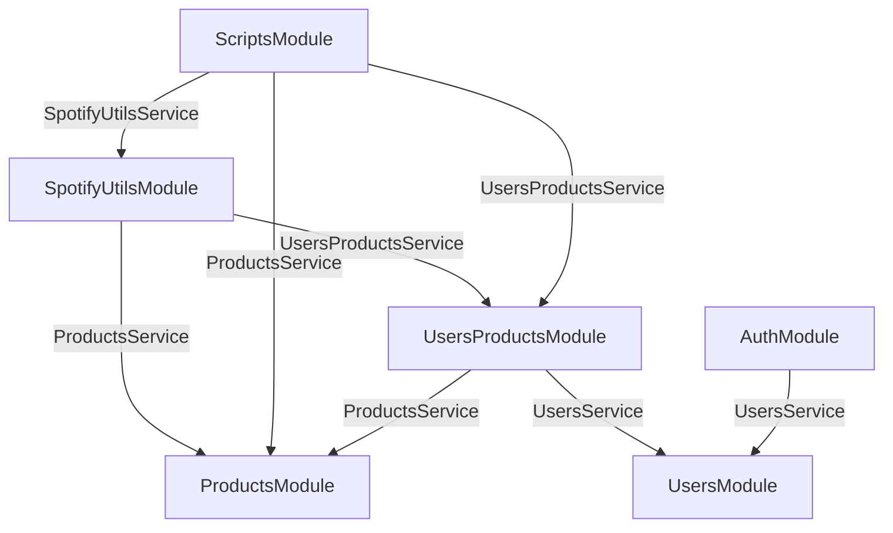

# Development documentation

## Architecture diagram

Represent dependencies between modules. Each arrow means that the source module uses from the target module, the service labeled.



- Modules not being targeted should not export anything.
- Modules targeted should only export their corresponding services.
- Source modules should only import the modules they target.

## Environment variables

`.env`:

```
DB_HOST=
DB_NAME=
DB_USER=
DB_PASSWORD=
DB_PORT=
JWT_SECRET=
JWT_EXPIRES_IN=
REFRESH_JWT_SECRET=
REFRESH_JWT_EXPIRES_IN=
```

# Technical documentation

## Project setup

```bash
$ npm install
```

## Compile and run the project

```bash
# development
$ npm run start

# watch mode
$ npm run start:dev

# production mode
$ npm run start:prod
```

## Run tests

```bash
# unit tests
$ npm run test

# e2e tests
$ npm run test:e2e

# test coverage
$ npm run test:cov
```
